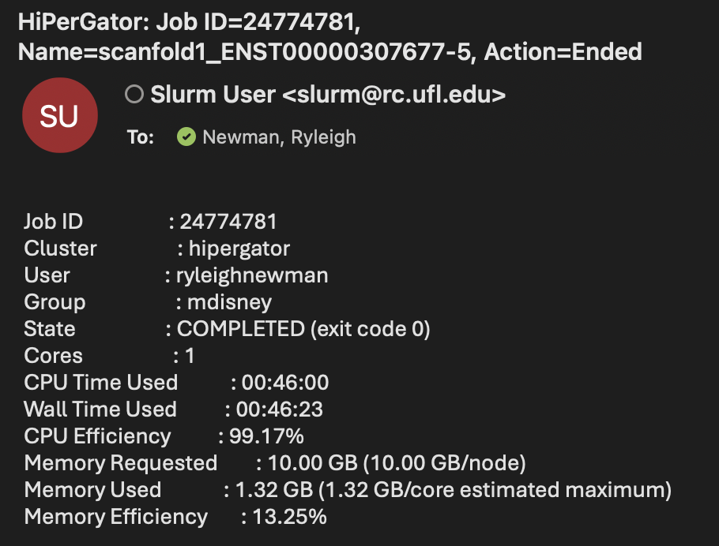
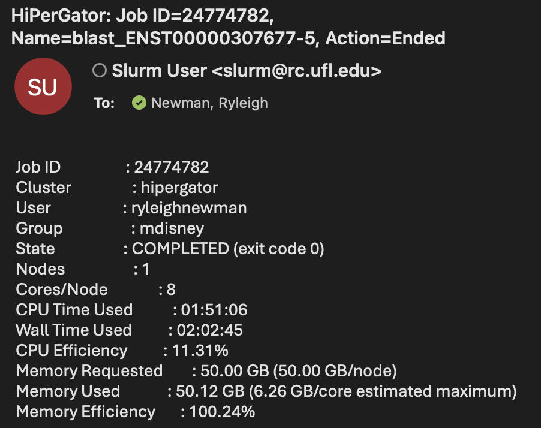

# Cobretti Pipeline - HiPerGator Guide

A step-by-step guide for executing the RNA covariation pipeline on University of Florida Scripps HiPerGator infrastructure.

*Cobretti was created by the [Moss Lab](https://mosslab.org). The official [Cobretti manual](https://github.com/moss-lab/Cobretti) was referenced in the preparation of this guide.*

This repository contains a modified `cobretti.py` compatible with Python 3.8, customized specifically for the UF HiPerGator system.

> **Before you begin:** My username (`ryleighnewman`) appears throughout this guide and inside the Python file. Use Find & Replace to substitute your own username. Review all `/blue/...` paths and email addresses. Fork or clone this repository so you can safely modify it for your own environment.

---

## Table of Contents

1. [Prerequisites](#prerequisites)
2. [Step 0 - Connect and Prepare Workspace](#step-0--connect-and-prepare-workspace)
3. [Step 1 - Replace Cobretti Python File](#step-1--replace-cobretti-python-file)
4. [Step 2 - Install Required Python Dependency](#step-2--install-required-python-dependency)
5. [Step 3 - Upload FASTA File](#step-3--upload-fasta-file)
6. [Step 4 - Install NCBI BLAST+](#step-4--install-ncbi-blast)
7. [Step 5 - Stage 1A1 (ScanFold + BLAST)](#step-5--stage-1a1-scanfold--blast)
8. [Step 6 - Stage 1B (Pseudoknot Expansion)](#step-6--stage-1b-pseudoknot-expansion)
9. [Step 7 - cm-builder (Covariance Model Construction)](#step-7--cm-builder-covariance-model-construction)
10. [Step 8 - Stage 1C (R-scape Covariation Analysis)](#step-8--stage-1c-r-scape-covariation-analysis)
11. [Troubleshooting](#troubleshooting)
12. [Pipeline Output Summary](#pipeline-output-summary)

---

## Prerequisites

### Required Files

Download both files before proceeding.

| File | Description |
|------|-------------|
| [`cobretti.py`](https://github.com/ryleighnewman/Cobretti-Pipeline-Disney-Lab/blob/main/cobretti.py) | Modified Cobretti script (Python 3.8 compatible) |
| [`Homo_sapiens_ENST00000307677_5_sequence.fa`](https://github.com/ryleighnewman/Cobretti-Pipeline-Disney-Lab/blob/main/Homo_sapiens_ENST00000307677_5_sequence.fa) | Example gene used in this tutorial (BCL2L1) |

The `.fa` file can be used as a reference for testing your setup. Keep both files in your Downloads folder for now.

---

## Step 0 - Connect and Prepare Workspace

### 0.1 Login from Local Machine

```bash
ssh ryleighnewman@hpg.rc.ufl.edu
```

### 0.2 Start a Persistent Session

Using `screen` keeps your session alive if you disconnect.

```bash
screen -S cobretti
```

| Action | Command |
|--------|---------|
| Detach | `Ctrl + A`, then `D` |
| Reattach | `screen -r cobretti` |

### 0.3 Create Project Directory

```bash
mkdir -p /blue/mdisney/ryleighnewman/cobretti_project
```

### 0.4 Enter Project Directory

```bash
cd /blue/mdisney/ryleighnewman/cobretti_project
```

### 0.5 Clone Moss Lab Repository

```bash
git clone https://github.com/moss-lab/Cobretti.git
```

The Moss Lab repository is required, but its original Python file must be replaced in the next step.

---

## Step 1 - Replace Cobretti Python File

The original script targets Python 3.6. This modified version fixes compatibility issues for Python 3.8 on HiPerGator.

Upload the modified file from your local machine:

```bash
scp /Users/ryleighnewman/Downloads/cobretti.py \
    ryleighnewman@hpg.rc.ufl.edu:/blue/mdisney/ryleighnewman/cobretti_project/Cobretti/cobretti.py
```

---

## Step 2 - Install Required Python Dependency

This only needs to be run once per account.

```bash
module load python/3.8
pip install --user biopython
```

---

## Step 3 - Upload FASTA File

### 3.1 Upload from Local Machine

```bash
scp "/Users/ryleighnewman/Desktop/DISNEY LAB/DepMap Top 10/BCL2L1/Homo_sapiens_ENST00000307677_5_sequence.fa" \
    ryleighnewman@hpg.rc.ufl.edu:/blue/mdisney/ryleighnewman/cobretti_project/
```

### 3.2 Verify the File Header

Header formatting is critical - it must match the Cobretti Manual exactly.

```bash
head -n 5 Homo_sapiens_ENST00000307677_5_sequence.fa
```

### 3.3 Check for Windows Line Endings

```bash
head -n 1 Homo_sapiens_ENST00000307677_5_sequence.fa | cat -A
```

If `^M` appears at the end of the line, the file has Windows line endings and must be fixed:

```
>ENST00000307677.5 BCL2L1-201 cdna:protein_coding^M$   ← broken
>ENST00000307677.5 BCL2L1-201 cdna:protein_coding$     ← correct
```

Fix a single file:

```bash
dos2unix Homo_sapiens_ENST00000307677_5_sequence.fa
```

Fix all files in a directory at once:

```bash
find . -type f -exec dos2unix {} +
```

---

## Step 4 - Install NCBI BLAST+

Required for Stage 1A1 and 1B. Install locally in your `/blue` directory if it is not available system-wide.

### 4.1 Move to Your Blue Directory

```bash
cd /blue/mdisney/ryleighnewman
```

### 4.2 Download and Extract

```bash
wget https://ftp.ncbi.nlm.nih.gov/blast/executables/blast+/2.15.0/ncbi-blast-2.15.0+-x64-linux.tar.gz
tar -xvzf ncbi-blast-2.15.0+-x64-linux.tar.gz
```

### 4.3 Add BLAST to Your PATH

This must be run each session before submitting pipeline jobs:

```bash
export PATH=/blue/mdisney/ryleighnewman/ncbi-blast-2.15.0+/bin:$PATH
```

### 4.4 Confirm Installation

```bash
which blastn
# Expected: /blue/mdisney/ryleighnewman/ncbi-blast-2.15.0+/bin/blastn
```

---

## Step 5 - Stage 1A1 (ScanFold + BLAST)

Return to your project directory before proceeding.

```bash
cd /blue/mdisney/ryleighnewman/cobretti_project
```

### 5.1 Create the SLURM Script

```bash
vi cobretti_stage1A1.sh
```

Press `i` and paste the following, then save with `:wq`:

```bash
#!/bin/bash
#SBATCH --partition=hpg-default
#SBATCH --time=1-00:00:00
#SBATCH --nodes=1
#SBATCH --ntasks-per-node=1
#SBATCH --job-name=Cobretti1A1
#SBATCH --mail-user=ryleighnewman@ufl.edu
#SBATCH --mail-type=ALL

module load python/3.8
export PATH=/blue/mdisney/ryleighnewman/ncbi-blast-2.15.0+/bin:$PATH

python Cobretti/cobretti.py -stage 1A1 -email ryleighnewman@ufl.edu
```

### 5.2 Submit the Job

```bash
module load python/3.8
sbatch cobretti_stage1A1.sh
```

### 5.3 Monitor Progress

```bash
squeue -u $USER
ls -lt slurm-*.out
tail -n 50 slurm-<jobid>.out
```

### 5.4 Runtime Reference

| Stage | Approximate Runtime |
|-------|-------------------|
| ScanFold | ~45 minutes |
| BLAST | ~120 minutes |




An email notification is sent upon completion.

### 5.5 Verify Stage 1A1

**Confirm the queue is clear:**

```bash
squeue -u $USER
```

**Confirm the output directory was created:**

```bash
ls ENST00000307677.5
find ENST00000307677.5 | wc -l
# Expected: 67 files
```

**Confirm supporting scripts and directories exist:**

```bash
ls scanfold1_ENST00000307677-5.sh
ls blast_ENST00000307677-5.sh
ls sequences
ls databases
```

**Check SLURM logs for errors:**

```bash
grep -i "error\|traceback" slurm-<jobid>.out
```

**Expected output files inside `ENST00000307677.5/`:**

| File | Description |
|------|-------------|
| `*.win_120.stp_1.rnd_100.shfl_mono.out` | ScanFold sliding window results |
| `.scan-zscores.wig` | Z-score track |
| `.scan-MFE.wig` | Minimum Free Energy track |
| `.scan-ED.wig` | Ensemble Diversity track |
| `.scan-pvalue.wig` | Statistical significance track |
| `Zavg_-2_pairs.ct` | High-confidence base pairs (z ≤ -2) |
| `Zavg_-1_pairs.ct` | Moderate-confidence base pairs (z ≤ -1) |
| `Zavg_NoFilter.ct` | All detected base pairs |
| `*_motif_N.ct` / `.dbn` / `.ps` | Structural motif files |
| `ExtractedStructures.gff3` | IGV-compatible annotation |
| `IGV_BP_Track*.bp` | Base pair coordinate track |

> **What is Zavg?** ScanFold averages z-scores across all windows for each base pair. More negative values indicate more unusually stable (and likely biologically meaningful) structural interactions.

---

## Step 6 - Stage 1B (Pseudoknot Expansion)

### 6.1 Create the SLURM Script

```bash
vi cobretti_stage1B.sh
```

Press `i` and paste the following, then save with `:wq`:

```bash
#!/bin/bash
#SBATCH --partition=hpg-default
#SBATCH --time=1-00:00:00
#SBATCH --nodes=1
#SBATCH --ntasks-per-node=1
#SBATCH --mem=40G
#SBATCH --job-name=Cobretti1B
#SBATCH --mail-user=ryleighnewman@ufl.edu
#SBATCH --mail-type=ALL

module load python/3.8
export PATH=/blue/mdisney/ryleighnewman/ncbi-blast-2.15.0+/bin:$PATH

python Cobretti/cobretti.py -stage 1B -email ryleighnewman@ufl.edu
```

### 6.2 Submit the Job

```bash
sbatch cobretti_stage1B.sh
```

This job takes approximately **7 minutes**.

### 6.3 Verify Stage 1B

**Check motif extension:**

```bash
ls -lh extended.dbn
grep -c ">" extended.dbn
# Expected: 15 motifs (for BCL2L1)
```

**Check pseudoknot cleanup:**

```bash
ls -lh pk_clean.txt
grep -c ">" pk_clean.txt
# Expected: ~60 motifs (approximately 4× the extended.dbn count)
```

**Confirm all expected files are present:**

```
extended.dbn
tmppk.txt
pk_clean.txt
pk_motifs/
cmbuilder_*.sh
```

---

## Step 7 - cm-builder (Covariance Model Construction)

Stage 1B generates `cmbuilder_*.sh` scripts but does **not** submit them. For a single-transcript run, you will typically see `cmbuilder_1.sh` through `cmbuilder_8.sh`.

### 7.1 Apply the Perl Path Fix

There is an incompatibility between these scripts and the UF HiPerGator system. Without this fix, every cm-builder job will fail silently with the following error:

```
Cwd.c: loadable library and perl binaries are mismatched (got handshake key 0xdb80080, needed 0xed00080)
```

Apply the fix to all scripts at once:

```bash
for f in cmbuilder_*.sh; do
  sed -i 's|^perl |/apps/perl/perls/perl-5.24.1/bin/perl |' "$f"
done
```

Verify the fix was applied:

```bash
grep -n "perl" cmbuilder_1.sh | head -5
# Each perl line should now start with /apps/perl/perls/perl-5.24.1/bin/perl
```

### 7.2 Submit All cm-builder Jobs

```bash
for f in cmbuilder_*.sh; do sbatch $f; done
```

### 7.3 Monitor Progress

```bash
squeue -u $USER
```

cm-builder jobs typically take **1 to 1.5 hours** each on the hpg-default partition.

### 7.4 Verify cm-builder Output

**Confirm the queue is clear:**

```bash
squeue -u $USER
```

**Confirm `.cm` files were generated:**

cm-builder writes output files to the **main project directory**. Check that they exist and are non-empty:

```bash
find . -maxdepth 1 -name "*.cm" | wc -l
find . -name "*.cm" -size 0 -print   # Should return nothing
```

If any empty `.cm` files are found, remove them before proceeding:

```bash
find . -name "*.cm" -size 0 -delete
```

**Check the SLURM log:**

```bash
cat $(ls -t slurm-*.out | head -1)
```

A successful run ends with:

```
[+] All done.
```

> **Note on expected warnings:** The following messages appear in every cm-builder log and are **non-fatal**. They do not indicate failure and can be safely ignored.
>
> ```
> Cwd.c: loadable library and perl binaries are mismatched (got handshake key 0xdb80080, needed 0xed00080)
> ```
> ```
> gnuplot: error while loading shared libraries: libwebp.so.6: cannot open shared object file: No such file or directory
> ```

---

## Step 8 - Stage 1C (R-scape Covariation Analysis)

### 8.1 Pre-flight Check

Confirm `.cm` files exist and are non-empty before running Stage 1C:

```bash
find . -name "*.cm" | wc -l
find . -name "*.cm" -size 0 -print   # Should return nothing
```

### 8.2 Run Stage 1C

```bash
module load python/3.8
python Cobretti/cobretti.py -stage 1C -email ryleighnewman@ufl.edu
```

Expected output:

```
INFO: Cobretti stage 1C run in progress...
INFO: Organizing files and running R-Scape...
Submitted batch job <jobid>
INFO: R-Scape complete, organizing results...
INFO: Cobretti run completed successfully!
```

Stage 1C generates a SLURM script at `sh/rscape.sh` and submits it immediately. This script runs R-scape on all `.stockholm` files, generates PDF visualizations, and automatically triggers Stage 1CA upon completion.

<details>
<summary>View generated <code>sh/rscape.sh</code></summary>

```bash
#!/bin/bash -l
#SBATCH --partition=hpg-default
#SBATCH --time=1-00:00:00
#SBATCH --nodes=1
#SBATCH --account=scripps-dept
#SBATCH --qos=scripps-dept-b
#SBATCH --mem=50G
#SBATCH --ntasks-per-node=1
#SBATCH --job-name=rscape
#SBATCH --mail-user=ryleighnewman@ufl.edu
#SBATCH --mail-type=END,FAIL

module load gcc ghostscript gnuplot

for f in *.stockholm; do /apps/cobretti/1.0/programs/rscape/bin/R-scape -s --ntree 10 $f; done
sed -i.bak "/#=GF R2R*/d" *.sto
for g in *.sto; do /apps/cobretti/1.0/programs/r2r/bin/r2r --disable-usage-warning $g $(basename $g sto)pdf; done
gs -dNOPAUSE -sDEVICE=pdfwrite -sOUTPUTFILE=All.Rscape.pdf -dBATCH *.R2R.pdf
wait;
module load cobretti
python /blue/mdisney/ryleighnewman/cobretti_project/Cobretti/cobretti.py -stage 1CA -email ryleighnewman@ufl.edu &
wait;
```

</details>

### 8.3 Monitor the R-scape Job

```bash
squeue -u ryleighnewman
watch -n 2 squeue -u ryleighnewman
```

> **Note:** This job runs under the `scripps-dept` account and QOS, which may have different queue priority than standard `hpg-default` jobs.

### 8.4 Verify Stage 1C Output

**Confirm the queue is clear:**

```bash
squeue -u $USER
```

**Check for R-scape output files:**

```bash
find . -name "*rscape*" | head -30
find . -type f -name "*rscape*" -size 0 -print   # Should return nothing
```

**Confirm the combined PDF was generated:**

```bash
ls -lh All.Rscape.pdf
```

**Check SLURM logs for errors:**

```bash
grep -rniA 5 "Traceback" slurm-*.out
grep -rniA 5 "Error" slurm-*.out
```

---

## Troubleshooting

### Stage 1C produces no outputs

Inspect the generated R-scape script:

```bash
cat sh/rscape.sh
```

Verify:
- Module loads are present (`gcc`, `ghostscript`, `gnuplot`)
- `.stockholm` files exist in the project directory
- No missing dependencies

### Jobs complete instantly but produce nothing

This typically means either:
- Input `.cm` files were empty or invalid - re-run cm-builder after removing empty files
- An environment or module issue occurred at runtime - check the SLURM log for the specific error

### cm-builder jobs all fail

If you forgot to apply the Perl fix before submitting, all jobs will fail with the mismatch error. Re-apply the fix and resubmit:

```bash
for f in cmbuilder_*.sh; do
  sed -i 's|^perl |/apps/perl/perls/perl-5.24.1/bin/perl |' "$f"
done
for f in cmbuilder_*.sh; do sbatch $f; done
```

---

## Pipeline Output Summary

Upon successful completion of all stages, you will have:

| Stage | What It Produces |
|-------|-----------------|
| **1A1** | ScanFold structural predictions, BLAST homology database |
| **1B** | Pseudoknot-expanded motifs, covariance model build scripts |
| **cm-builder** | Calibrated covariance models (`.cm` files) for each motif |
| **1C / R-scape** | Covariation significance scores, `All.Rscape.pdf` |
| **1CA** | Organized final results |

At this point you have a complete structural and evolutionary analysis for your transcript, including:

- Structural predictions (ScanFold)
- Sequence homology (BLAST)
- Covariance models (cm-builder)
- Covariation validation (R-scape)
- Combined results PDF (`All.Rscape.pdf`)
